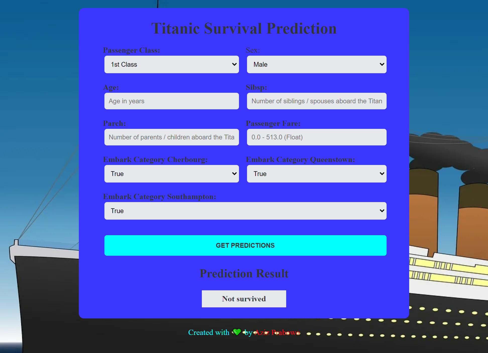

# Description

This is a Machine Learning model that utilizes Logistic Regression to predict the survival of passengers aboard the Titanic. The model is trained on a dataset consisting of various passenger attributes such as age, gender, ticket class, and more. By analyzing these features, the model can make predictions on whether a passenger would have survived or not. 

In addition, this project includes a web application deployed on the Heroku platform, serving as the focal point for experimenting with deploying an ML model using Django. The web application enables users to interact with the trained model and receive predictions on the survival probability of a passenger based on the information provided.

# Screenshot

